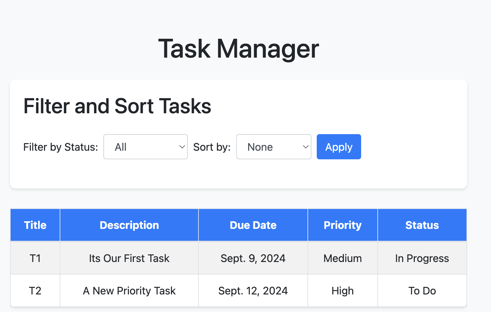
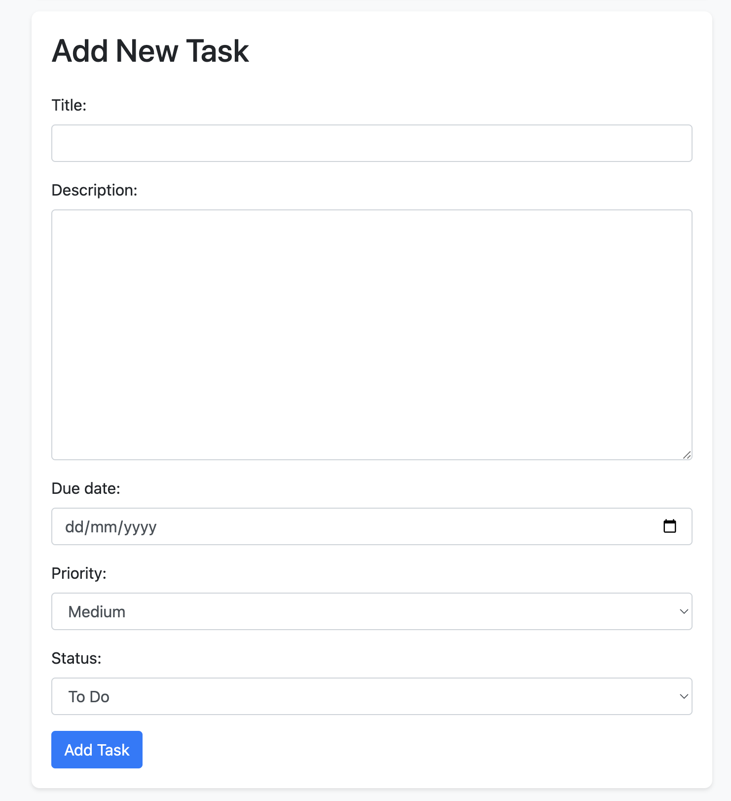

# Django Task Management App

This is a simple Task Management application built using Django. The app allows users to add tasks, filter them by status, and sort by priority or due date. Additionally, users can easily add new tasks through the user interface.

## Features
- Add new tasks with a title, description, due date, priority, and status.
- Filter tasks by status (To Do, In Progress, Done).
- Sort tasks by priority or due date.
- Responsive UI for an optimal user experience across devices.

## Screenshots

  

## Getting Started

### Prerequisites

Make sure you have the following installed:
- Python 3.12.1
- Django 5.1.1

### Installation

1. **Clone the repository**:
   ```bash
   git clone https://github.com/aansh06/task_TO_DO.git
   cd task_TO_DO
   ```

2. **Create and activate a virtual environment**:
   ```bash
   python -m venv env
   source env/bin/activate   # For Linux/macOS
   # or
   env\Scripts\activate      # For Windows
   ```

3. **Install dependencies**:
   Install all the necessary dependencies by running:
   ```bash
   pip install -r requirements.txt
   ```

4. **Run database migrations**:
   Apply the database migrations to set up the initial database schema:
   ```bash
   python manage.py migrate
   ```

5. **Run the development server**:
   Start the Django development server:
   ```bash
   python manage.py runserver
   ```

6. **Access the application**:
   Open your browser and navigate to:
   ```
   http://127.0.0.1:8000/
   ```

### Usage

- **Filter Tasks**: Use the dropdown menu to filter tasks by status (e.g., "To Do", "In Progress", "Done").
- **Sort Tasks**: Use the sort options to arrange tasks by priority or due date.
- **Add Tasks**: Enter task details and click "Add Task" to create a new task.

### Running Tests

To run the unit tests for the filtering and sorting functionality, use the following command:
```bash
python manage.py test
```
